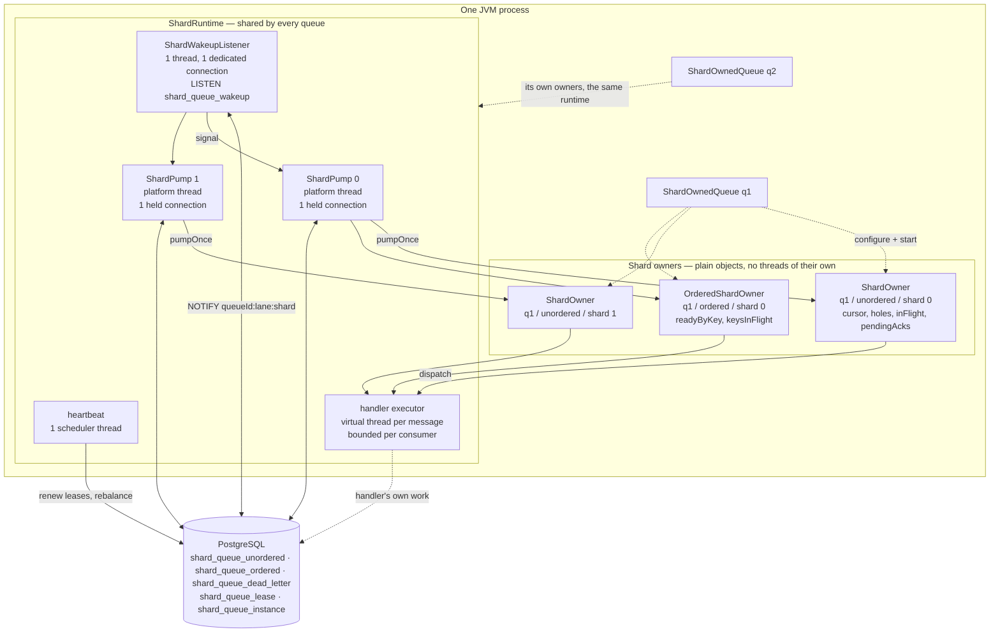
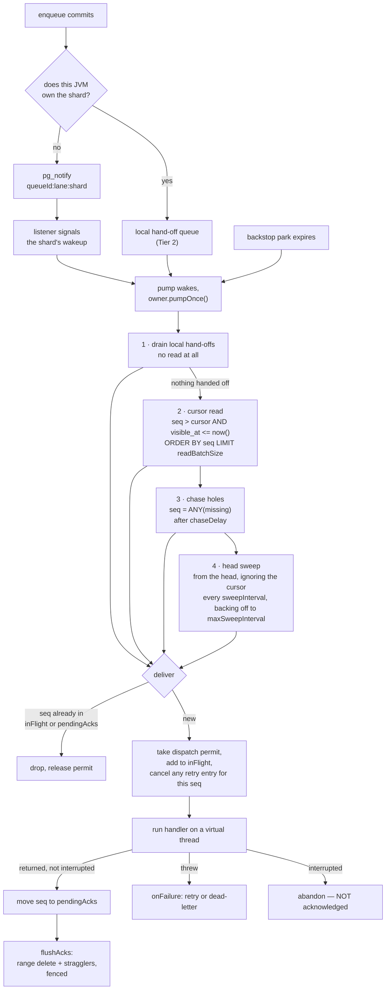
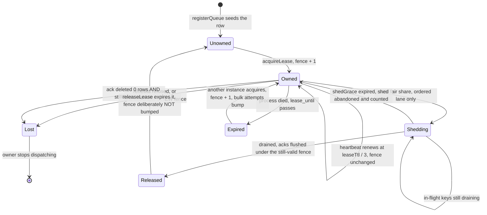

# Shard-Owned PostgreSQL Queue — How It Works

**Module:** `components/postgresql-queue-shard-owned`
**Package:** `dk.trustworks.essentials.components.queue.shardowned`
**Status:** Experimental. Builds and tests with the reactor, **not published** (`maven.deploy.skip=true`). 7 unit tests and 69 integration tests, plus 8 in the Spring Boot starter, all green. No production use.

This document describes the engine as it currently stands: its storage, its threading, how a message travels from `enqueue` to a handler, and what it does when something fails. It is a reference for the system as built, not a record of how it came to be built that way.

Related documents:

| Document | Contents |
|---|---|
| [`LLM/LLM-postgresql-queue-shard-owned.md`](../LLM/LLM-postgresql-queue-shard-owned.md) | Consumer-facing configuration reference, sizing formulas, worked examples |
| [`docs/durable-queue-measurements.md`](./durable-queue-measurements.md) | Every measured number, and the environment that produced it |
| [`components/postgresql-queue-shard-owned/CLAUDE.md`](../components/postgresql-queue-shard-owned/CLAUDE.md) | Contributor gotchas and invariants |
| [`docs/archive/durable-queue-design-history.md`](./archive/durable-queue-design-history.md) | The original design proposal and its chronological defect log. Section references of the form `§4.3` in source comments point here |

---

## 1. The one idea

> Every message is assigned to a shard at enqueue. Each shard has exactly one owning consumer at a time, held by a lease. A consumer reads only shards it owns.

Three consequences follow directly, and everything else in the engine is a detail of making them work.

**There is no claim write.** A conventional PostgreSQL queue marks a row `is_being_delivered = true` so that competing consumers do not take it twice. Under shard ownership nobody else is reading the row, so the claim is implied by the lease and never reaches the database. Measured: `n_tup_upd` is zero on the steady-state path, and dead tuples per message fall to exactly 1.00 — the acknowledging delete and nothing else.

**There is no `SKIP LOCKED` and no lock contention.** Two consumers never look at the same row, so no scan work is wasted on rows another consumer has already taken.

**Per-key ordering is a consequence of ownership rather than of a query.** Messages sharing a key hash to the same shard; one instance owns that shard; that instance enforces FIFO with an in-memory set of the keys it currently has in flight. The expensive correlated anti-join a query-based ordered queue runs on every poll does not exist here. Because the guarantee rests on the lease rather than on a JVM's memory alone, it holds across processes.

The cost of these properties is paid in three places, all of which the rest of this document describes: a cursor that can step over uncommitted sequence values and must chase them (§5.3), a lease protocol that must fence out a superseded owner (§8), and a fixed shard count that cannot change once messages exist (§10).

---

## 2. Storage

Six tables and three families of sequence. `ShardOwnedSchema.create(dataSource, shardCount)` builds them once per database; `ShardOwnedSchema.registerQueue(dataSource, queueId, shardCount)` makes one queue usable.

### 2.1 The two live lanes

Ordered and unordered messages have different natural primary keys, and in one table only one of them could have it. They therefore get separate tables.

**`shard_queue_unordered`** — the high-volume lane.

```sql
CREATE TABLE shard_queue_unordered (
    queue_id      smallint    NOT NULL,
    shard         smallint    NOT NULL,
    seq           bigint      NOT NULL,   -- from shard_queue_seq_q<queue>_s<shard>
    payload       bytea       NOT NULL,
    payload_type  int         NOT NULL,
    meta_data     bytea,
    enqueued_at   timestamptz NOT NULL DEFAULT now(),
    visible_at    timestamptz NOT NULL DEFAULT now(),
    attempts      smallint    NOT NULL DEFAULT 0,
    lease         bigint,                 -- owner fence (pre-claim) or session fence (negative)
    lease_until   timestamptz,            -- NULL for a pre-claim, set for a session row lease
    PRIMARY KEY (queue_id, shard, seq)
) WITH (fillfactor = 80);

CREATE INDEX shard_queue_unordered_visible ON shard_queue_unordered (queue_id, shard, visible_at);
```

The primary key *is* the read index: the fast path is a forward range scan on `(queue_id, shard, seq)` with no secondary index to maintain on insert. The `_visible` index serves only the head sweep and delayed rows.

**`shard_queue_ordered`** — the per-key FIFO lane. Same columns plus `msg_key` and `key_order`, with a different primary key and one extra index:

```sql
    PRIMARY KEY (queue_id, shard, msg_key, key_order)   -- head-of-key is a PK prefix scan
    CREATE INDEX shard_queue_ordered_seq     ON shard_queue_ordered (queue_id, shard, seq);        -- discovery
    CREATE INDEX shard_queue_ordered_visible ON shard_queue_ordered (queue_id, shard, visible_at); -- sweep
```

Finding the head of a key, and asking whether a key has anything queued, are both primary-key prefix operations. The `_seq` index exists because the owner still needs to discover newly arrived work in commit order — it is the index the ordered lane pays for and the unordered lane does not.

Shared choices across both lanes:

- **`bytea`, not `jsonb`.** The database never looks inside a payload. Bytes skip JSON validation on write and detoast on read. Serialization is the caller's concern.
- **`smallint` `queue_id`,** interned via the registry (§2.4) rather than repeated as text, so the primary key of every row stays two bytes and the hot index stays dense.
- **`int` `payload_type`** is a discriminator the *application* defines, so a handler can tell what the bytes are without unpacking them. It is opaque to the engine: stored, carried through dead-lettering and resurrection, handed to the handler, and never compared, indexed or interpreted. Nothing interns it and nothing validates it — the mapping to a type name lives in each application, so two services disagreeing about what `1` means is not something this engine can detect. An earlier draft called it an "interned FQCN" and justified it as index density; it is in no index, and until recently the push handler was never given it at all.
- **No `is_being_delivered`, no `delivery_ts`.** Ownership replaces them.
- **`fillfactor = 80`,** so the rare failure-path `UPDATE` is a HOT update touching no index.

### 2.2 The cold lane

**`shard_queue_dead_letter`** holds messages the redelivery policy gave up on. It carries `source_lane`, the original `shard` and `seq`, the key and key order where they apply, `attempts`, `last_error` and `dead_lettered_at`. Keeping dead letters out of the live lanes is what lets an acknowledged row simply vanish rather than becoming a flag the live queries have to filter on.

The payload here is `bytea` like everywhere else. Payloads are opaque bytes end to end in this engine, so a `jsonb` dead-letter column would mean inventing a decode nothing else has.

### 2.3 Schema creation

`ShardOwnedSchema.initialize(dataSource)` creates everything if absent — non-destructive and
idempotent, so it is safe on every application start. `recreate(dataSource)` drops it all first and
is for tests and deliberate resets. Until the starter was written there was only the destructive
one, which is fine for a fixture and a loaded gun in a start-up hook.

**All DDL runs under the framework's bootstrap advisory lock**
(`pg_advisory_xact_lock(0xE55E_4711_B007_DD15)`, the same key `PostgresqlUtil` uses), inside an
explicit transaction. PostgreSQL's `IF NOT EXISTS` is *not* atomic against concurrent sessions: two
instances starting together can both read "absent" from `pg_class` and one fails with a
`pg_type_typname_nsp_index` violation. Sharing the framework's key rather than picking a private one
is what makes this safe alongside an event store bootstrapping at the same moment; a unit test
asserts the two constants have not drifted, since the module cannot import the canonical one.

### 2.4 The registry — names, ids and shard counts

```sql
CREATE SEQUENCE shard_queue_id_seq START WITH 1 INCREMENT BY 1 MAXVALUE 32767;

CREATE TABLE shard_queue_registry (
    queue_id    smallint    NOT NULL PRIMARY KEY,
    queue_name  text        NOT NULL UNIQUE,
    shard_count int         NOT NULL,
    created_at  timestamptz NOT NULL DEFAULT now()
);
```

The engine addresses a queue by an interned `smallint`, because a two-byte column in the primary key
of every row is what keeps the hot index dense. That is a storage decision and it does not change.
What changed is where the mapping from a *name* to that id lives: it used to live in each caller,
which is a shared contract stored in several places at once.

`registerQueue(dataSource, QueueName.of("orders"), 8)` interns the name under the table's unique
constraint, so every process at start-up converges on one id instead of racing to pick different
ones. Id gaps are harmless — an id is an interning token, and a value burned by a losing
`ON CONFLICT` means nothing. The ceiling is 32 767 queues.

**`shard_count` is in this table, and that is the point.** A key's shard is
`hash(key) mod shardCount`, so the count is a property of the *queue*, not of the process reading it.
It used to be a constructor argument each process supplied for itself, and a disagreement was
silent: a producer believing in eight shards and a consumer believing in four write to shards
4–7 that nobody leases and nobody delivers. `ShardOwnedQueueRegistryIT` reproduces exactly that, so
the protection is measured against a real failure rather than asserted. Registering a name with a
different count is now refused, and a queue built from a name takes both the id and the count from
the registry — leaving a caller nowhere to express the disagreement.

### 2.5 Ownership and membership

**`shard_queue_lease`** — who owns what.

```sql
CREATE TABLE shard_queue_lease (
    queue_id    smallint    NOT NULL,
    lane        text        NOT NULL,
    shard       smallint    NOT NULL,
    owner       text,
    fence       bigint      NOT NULL DEFAULT 0,
    lease_until timestamptz NOT NULL DEFAULT now(),
    PRIMARY KEY (queue_id, lane, shard)
);
```

`lane` is part of the key because the lanes are separate tables with separate owners. One lease row per shard shared by both lanes would let an unordered message land in a shard leased by the ordered consumer, which never reads that table.

Lease rows are seeded by `registerQueue`, so acquiring a shard is an `UPDATE` — the row's existence is never contended, only its ownership.

**`shard_queue_instance`** — membership.

```sql
CREATE TABLE shard_queue_instance (
    queue_id    smallint    NOT NULL,
    instance_id text        NOT NULL,
    last_seen   timestamptz NOT NULL DEFAULT now(),
    PRIMARY KEY (queue_id, instance_id)
);
```

Membership needs its own table because the lease table cannot answer "how many instances are there". An instance holding no shards — the one that most needs counting, since it is waiting for a share — leaves no trace in the lease table.

### 2.6 Reading a queue in psql

Payloads are `bytea` because the database never looks inside them, which is what keeps the write path
cheap — and what makes `SELECT payload` return `\x7b226f...` to an operator holding a support ticket.

Three views fix the ergonomics without touching the storage: `shard_queue_unordered_readable`,
`shard_queue_ordered_readable` and `shard_queue_dead_letter_readable`. Each joins the registry so the
queue's *name* is a column rather than an interned id, and renders the payload through
`shard_queue_readable(bytea)`, which returns text for valid UTF-8 — JSON, XML and plain text all
qualify — and falls back to hex otherwise rather than raising. A view that throws on one binary row
would be worse than one that shows it as hex.

The bytes stay bytes; the engine reads none of this.

### 2.7 Growing a queue's shard count

The two lanes are not equally pinned, and treating them as one is what made the count look immutable.

**Unordered messages are assigned round-robin**, so nothing about them depends on which shard they
landed in. Adding shards adds sequences and lease rows; the messages already stored stay where they
are and are still delivered by whoever owns those shards. There is nothing to re-route.

**Ordered messages are the constraint, and the mechanism is the modulus.** A key's shard is
`hash(key) mod shardCount`. Change the count and a key's *next* message hashes to a different shard
from its *last* one — so one key ends up spread across two shards, with two owners dispatching it
concurrently. That is reordering, not the duplicate at-least-once permits, and no amount of care at
the read path can undo it: per-key order here is enforced by one owner holding one shard.

`ShardOwnedSchema.growShardCount(dataSource, name, n)` therefore **refuses while the ordered lane
holds anything for that queue**. Once it is empty there is no key whose history could be split, and
growing is safe.

**Shrinking is refused outright**, for a different reason: messages already sitting in the shards
being removed would be addressed by nobody. `shardForKey` and the round-robin cursor would both stop
producing those shard numbers, no consumer would lease them, and the rows would simply stay there.
There is no safe general answer to where they should go, so the supported route is to drain those
shards and recreate the queue.

**The caller still has to restart instances**, because the count is baked into every running
`ShardOwnedQueue` — the database knowing about eight shards changes nothing until the processes do.
Until they have all restarted, two moduli are in flight at once, which is the same hazard as above
and the other half of why the ordered lane must be empty first. For an unordered-only queue it is
harmless: messages have no key, every shard has an owner either way, so a **rolling restart is
enough — this is not a drain-and-switch.**

### 2.8 Sequences

Two per `(queue, shard)`: `shard_queue_seq_q<queue>_s<shard>` for the unordered lane and `shard_queue_ordered_seq_q<queue>_s<shard>` for the ordered one, both `CACHE 1` so an allocated value is one that will be committed. Plus one global `shard_queue_session_fence`, from which pull sessions draw **negative** fences so they can never collide with an owner fence in the shared `lease` column.

The per-`(queue, shard)` scoping is load-bearing. The cursor treats any sequence value it steps over as a hole to be chased, so a counter shared between queues would manufacture `queues − 1` holes per message. A dense sequence per queue is what makes "a gap means an uncommitted transaction" a true statement.

---

## 3. Process topology

Threads and connections are properties of the **process**, not of the shard count or the queue count. One `ShardRuntime` holds everything long-lived and is shared by every queue in the process.



The two axes are deliberately separate mechanisms:

**Database contact** runs on `ShardPump` — a **platform** thread holding one connection and serving many shards. The count comes from `ShardOwnerSettings.pumpThreads` (default 2), never from `shardCount`. Virtual threads are the wrong tool here: a virtual thread blocked in JDBC still holds a connection, so putting database work on them would raise the connection count rather than lower it.

**Handler concurrency** runs on one `newVirtualThreadPerTaskExecutor` per process, bounded per consumer by `ConsumerOptions.parallelConsumers`. Handlers are user code that mostly waits, which is what virtual threads are for. A message in flight costs a virtual thread and a permit, not a platform thread.

The resulting cost, regardless of how many queues or shards exist:

```
held connections = pumpThreads + 1        (the pumps, plus the listener)
threads, idle    = pumpThreads + 2        (the pumps, the listener, the heartbeat)
threads, loaded  = the above + handlers currently in flight (virtual)
```

Measured: 5 connections and 21 threads at 300 queues of 8 shards. A `ShardOwnedQueue` constructed without an explicit runtime borrows the one shared per `DataSource`, reference counted, closed by its last borrower.

### 3.1 How a pump decides what to do

Each shard has its own `ShardWakeup`, which cascades to the wake-up of the pump serving it. The pump parks on its own wake-up and then asks each of its shards `needsAttention()`, so a notification for one shard does not make the pump read all of them.

```java
while (running) {
    for (var owner : owners) {
        if (firstTimeSeen(owner))  owner.onTakeover(connection);  // bulk attempt bump
        if (!owner.leaseHeld())    continue;
        if (!owner.needsAttention()) continue;
        delivered += owner.pumpOnce(connection);   // RuntimeException caught per owner
    }
    if (delivered == 0) park();
}
```

`needsAttention()` is true when a wake-up has been signalled, when a local hand-off is waiting, when the sweep is due, when a retry has fallen due, when a hole is ready to chase, or when acknowledgements are due to flush. The park duration is the shortest deadline any of the pump's shards has, capped by `max(pollBackstop, maxSweepInterval)`.

Two rules the pump enforces that are easy to get wrong:

- **`onTakeover` runs before an owner's first `pumpOnce`, not before the pump's.** Pumps start before any shard is leased, and rebalancing adds shards later. The takeover attempt bump is the only thing standing between a handler that kills the JVM and an infinite redelivery loop, so it must not run after the owner has already delivered.
- **The pump catches `RuntimeException` per owner.** One thread serves several shards; an unchecked exception escaping one owner used to end the thread and silently stall every shard beside it, while the heartbeat went on renewing their leases.

On `SQLException` the pump reconnects rather than exiting, paced at 200 ms. The retrying is bounded by the lease: if the database is genuinely gone the heartbeat cannot renew either, every owner is marked lost, and the loop exits. A pump that dies is worse than a crash, because a crash gets noticed and restarted while a queue that quietly stops delivering does not.

---

## 4. Enqueue

Enqueue is a single multi-row `INSERT` into one shard's lane. Unordered messages are assigned round-robin from a per-queue cursor; ordered messages go to `Math.floorMod(key.hashCode(), shardCount)`. `String.hashCode` is specified by the JDK, so the key-to-shard mapping is stable across JVMs and restarts.

**Every enqueue path runs its batch in an explicit transaction.** This cannot be left to PostgreSQL's implicit transaction: pgjdbc sends a small batch as a single sync but splits a large one into synced chunks, so a ten-row batch is atomic by accident and a five-thousand-row batch is not. A caller who has already begun a transaction is left alone — their commit decides, which is the point of enqueueing transactionally.

Inside the same transaction, `pg_notify` is issued once per batch per shard with the payload `queueId:lane:shard`. Because it is inside the transaction, the hint is delivered only if the enqueue commits and is discarded if it does not.

If the enqueuing JVM also owns the target shard, the insert additionally stamps `lease` with the owner's fence — a **pre-claim** — and the row is handed to the owner in memory after the transaction commits. See §6.

---

## 5. Delivery

### 5.1 The four paths a message can arrive by



Paths 1 and 2 are the fast path. Path 3 costs one cheap point lookup and only exists while a hole is outstanding. Path 4 is pure insurance and is what makes correctness independent of the in-memory state being perfect.

An important property of this arrangement: **losing every notification costs latency and nothing else.** The backstop park and the head sweep still deliver. That is what makes it safe to coalesce notifications aggressively.

### 5.2 The cursor read

```sql
SELECT seq, payload FROM shard_queue_unordered
 WHERE queue_id = ? AND shard = ? AND seq > ? AND visible_at <= now()
   AND (lease IS NULL OR lease <> ?)              -- skip this owner's own pre-claims
   AND (lease_until IS NULL OR lease_until <= now())  -- skip rows a pull session holds
 ORDER BY seq
 LIMIT ?;
```

An index range scan in physical order. No lease join, no anti-join, no filtering of rows belonging to another consumer, and no dead tuples to rescan because acknowledged rows are gone rather than flagged.

The two `lease` predicates carry the whole of the row-level state:

| `lease` | `lease_until` | Meaning | Owner's read |
|---|---|---|---|
| NULL | NULL | ordinary row | delivers it |
| this owner's fence | NULL | pre-claim, already handed off in memory | skips it |
| *another* fence | NULL | pre-claim of a **dead** owner | delivers it — the stamp is self-expiring |
| negative fence | future | a pull session holds it | skips it until the lease lapses |

**Take the dispatch permit before the cursor advances past a row, never after.** A row that cannot be dispatched must still be there for the next read; advancing past it would leave it to the head sweep and register the gap as a hole that no transaction ever owned. Every delivering path — cursor, hand-off, chase, sweep, retry — acquires first and releases on a duplicate.

### 5.3 Holes: why the cursor is safe

A cursor over `seq` has a well-known hazard. Producer A takes `seq = 100`, producer B takes `seq = 101`, B commits first. A consumer reading `seq > cursor` sees 101, advances, and then A commits — 100 is now permanently behind the cursor.

Because a shard has exactly one reader, hole tracking is cheap and entirely in memory. The owner:

- **does not stall the cursor.** It records every value it stepped over in `pendingHoles` and keeps delivering everything it can see.
- **chases** with a targeted `WHERE seq = ANY(?)` after `chaseDelay` (default 2 ms), which resolves as soon as the late transaction commits. Measured hole resolution latency tracks `chaseDelay` almost exactly — the cost of a hole is set by how often the owner bothers to look, not by the database.
- **abandons** a value that never appears after `holeExpiry` (default 10 s), on the assumption its transaction aborted. This must exceed the longest expected enqueue transaction, or live messages get written off.

A hole costs a few milliseconds of extra latency for the delayed message only, and one cheap point-lookup query. Nothing else is affected, and the common path stays write-free.

### 5.4 Acknowledgement, and the floor that makes it safe

Handled sequence values accumulate in `pendingAcks` and flush when `ackBatchSize` (200) is reached or `ackFlushInterval` (1 ms) elapses. Because the owner reads in sequence order, what it has handled is usually a contiguous prefix, so the flush collapses to a range delete over physically adjacent rows plus a small remainder:

```sql
-- contiguous prefix
DELETE FROM shard_queue_unordered u WHERE u.queue_id = ? AND u.shard = ? AND u.seq <= ?
  AND (u.lease_until IS NULL OR u.lease_until <= now())
  AND EXISTS (SELECT 1 FROM shard_queue_lease l
               WHERE l.queue_id = u.queue_id AND l.lane = 'unordered' AND l.shard = u.shard
                 AND l.owner = ? AND l.fence = ? AND l.lease_until > now());

-- stragglers
DELETE FROM shard_queue_unordered u WHERE u.queue_id = ? AND u.shard = ? AND u.seq = ANY(?)
  AND EXISTS ( ...the same fence assertion... );
```

**The range delete is bounded below by a floor, and getting this wrong loses messages.**

```
safeFloor         = min(lowest in-flight seq, lowest pending hole seq)
contiguousThrough = highest contiguous acked seq strictly below safeFloor
```

Nothing at or above `safeFloor` may be range-deleted, however contiguous the prefix looks. A hole at sequence value *N* is a row that has not committed yet; once it commits it sits **below** the acknowledged prefix, and an unbounded range delete would remove it without it ever having been delivered.

**The straggler delete is deliberately not bounded by the floor.** The floor exists to stop a *range* from sweeping up rows that were never delivered. A targeted delete addresses exactly the sequence values this owner handled, so it can remove nothing it did not deliver, and applying the floor to it merely makes everything finished behind a slow handler wait for that handler.

Both statements carry the fence they were issued under and assert, in the same statement, that the lease still matches and has not expired — one extra index lookup on the lease table's primary key, per batch rather than per message.

**Zero rows deleted is ambiguous.** It means either that the fence clause rejected this owner or that the rows had already gone. Only the first means the shard has moved, so the owner asks `stillOwns` directly — one primary-key lookup, only on the ambiguous path — rather than inferring. Reading the second case as the first costs a lease the owner still holds: it stops, the shard is re-acquired, and everything in flight is redelivered.

### 5.5 Delivery is inline; handlers are not

`deliver()` runs on the pump thread and does three things under `stateLock`: deduplicate against `inFlight` and `pendingAcks`, add to `inFlight`, and cancel any retry-schedule entry for the same sequence value. It then hands the message to the virtual-thread executor.

Everything the pump thread and the handler threads both touch — `cursor`, `pendingHoles`, `inFlight`, `pendingAcks`, `retrySchedule` — is guarded by `stateLock`.

The cost of inline dispatch decisions is that a slow handler occupies its pump and therefore the other shards that pump serves. That is bounded and tunable through `pumpThreads`. It is the deliberate choice: making the *unordered* delivery decision asynchronous makes the cursor, the hole map, the in-flight set and the acknowledgement floor concurrent, and those four are what correctness rests on.

**An interrupted handler is not a success.** A handler that catches `InterruptedException` and returns normally — which is what well-behaved code does on shutdown — is otherwise indistinguishable from one that finished, and its message would be acknowledged without having been processed. The owner checks `Thread.currentThread().isInterrupted()` after the handler returns and counts an abandonment instead of an acknowledgement.

---

## 6. Wake-up

Three tiers. Each is faster than the one below it, each is optional, and **correctness never depends on any of them.**

**Tier 0 — the backstop park.** A pump parks until its shortest owner deadline, capped by `max(pollBackstop, maxSweepInterval)`. Combined with the head sweep this is the correctness floor. The sweep interval backs off only when a sweep actually *ran* — a pump iterates whenever any shard it serves has work, so backing off per iteration drove an idle shard to the thirty-second ceiling within milliseconds and quietly made both delayed delivery and lost-notification recovery thirty-second operations.

**Tier 1 — `LISTEN`/`NOTIFY`.** One global channel, `shard_queue_wakeup`, with the payload `queueId:lane:shard`. A single `ShardWakeupListener` on a dedicated connection demultiplexes to the right shard of the right lane of the right queue and signals its wake-up, which cascades to the pump's.

Three rules matter, and all three cost something real when broken:

- **The notify is issued by the application inside the enqueue transaction, coalesced to at most one per shard per batch.** A per-row trigger would turn every message into a notify, and PostgreSQL serializes notify-queue access cluster-wide.
- **The listener's connection never does work.** A busy listener delays every notification queued behind it.
- **The listener reconnects *and* re-runs `LISTEN`.** The subscription is per connection. Its failure is silent by construction — owners fall back to the backstop, so delivery continues and only latency degrades — which means no delivery-based test can detect it. Assert on notification counts.

**Tier 2 — local hand-off.** When the enqueuing JVM also owns the target shard, the message never needs to be read back. The insert stamps `lease` with the owner's current fence, and a post-commit hook hands the already-in-memory row straight to the owner's `localHandoffs` queue. The owner's cursor read excludes rows carrying its own fence, so the message is not read twice; a new owner takes the shard under a *new* fence, so rows pre-claimed by a dead owner become visible again automatically.

The hand-off drain runs first in `pumpOnce` and, if it delivered anything, returns without issuing a cursor read at all — which is the entire point of the tier.

**The head sweep deliberately does not skip pre-claims outright.** If a hand-off is lost — the process dies between commit and dispatch — the sweep is what still delivers the message. But a pre-claim committed moments ago is far more likely to be in flight than lost, so the sweep skips this owner's own pre-claims until they are older than a grace period.

**Tier 3 — WAL streaming.** Not built. Its gate was that it must clearly beat Tier 2 by enough to justify a replication slot's operational weight, and Tier 2 measures 0.44 ms at the median.

---

## 7. Ordering

`OrderedShardOwner` owns one shard of `shard_queue_ordered`. Its read is the same plain forward scan on `seq` (via `shard_queue_ordered_seq`); ordering is enforced entirely by two in-memory facts — a key's messages can only be in one shard, and one owner has all of that shard.

State it keeps per shard:

| Field | Purpose |
|---|---|
| `readyByKey` | `Map<key, TreeMap<key_order, row>>` — everything known but not yet delivered, ordered within each key |
| `keysInFlight` | keys with a message currently in a handler. **At most one per key — this is the FIFO guarantee** |
| `keysAwaitingRetry` | keys blocked by a failing message, so a later message cannot overtake it |
| `highestDeliveredOrder` | per key, used to count ordering violations |
| `activeKeys` | bounded by `keyConcurrency` (default 8), per shard |

Concurrency is per key, not per shard: many keys progress at once, and a key with a slow or stuck handler blocks only itself. That is the correct scope — head-of-line blocking should apply to the thing that actually demands ordering.

**On strictness.** A key advances through the `key_order` values that are present, one at a time. It does *not* wait for a missing `key_order` to arrive, because those values are producer-assigned and a gap may never be filled — waiting would stall the key forever on a producer's bookkeeping error. The consequence is counted rather than claimed away: a message that commits after a higher `key_order` for its key has already been delivered is an ordering violation, and `ShardOwnerMetrics.orderViolations` records it. Measured zero across every run so far.

The ordered lane acknowledges by sequence value rather than by range, batched with `ANY`. Keys progress independently, so what has been handled is rarely a contiguous run of `seq`, and inventing a second range-delete floor for it would reproduce §5.4's hazard for no gain.

---

## 8. Ownership, leases and fencing

### 8.1 Acquiring

```sql
UPDATE shard_queue_lease
   SET owner = ?,
       fence = CASE WHEN owner = ? THEN fence ELSE fence + 1 END,
       lease_until = now() + make_interval(secs => ? / 1000.0)
 WHERE queue_id = ? AND lane = ? AND shard = ?
   AND (lease_until < now() OR owner = ? OR owner IS NULL)
RETURNING fence;
```

The fence increments on a **change** of owner and not on a renewal. An instance takes at most `ceil(shardCount / liveInstances)` shards, which makes the assignment self-balancing with no coordinator: every instance derives the same fair share from the same `shard_queue_instance` table, so the split converges with nobody deciding it.

### 8.2 Lease lifecycle



The lease TTL is `ShardOwnerSettings.leaseTtl`, 30 seconds by default. It is its own setting rather than being derived from `holeExpiry`: the two are bounded by unrelated things — `holeExpiry` by the longest enqueue transaction, the lease TTL by the longest tolerable stop-the-world pause and by how long a failover may take — so deriving one from the other meant raising `holeExpiry` for a long outbox transaction silently tripled failover time. The heartbeat renews at a third of it, so a single missed renewal costs nothing. A renewal that is refused, or granted under a *new* fence (meaning the shard was taken and handed back), stops the owner at once rather than letting it discover the problem at acknowledgement time, by which point it may already have dispatched work its successor is also dispatching.

`ShardRuntime` is a restartable `Lifecycle` like everything above it — its executors are rebuilt by `start()`, because none of them can be revived once shut down. `stop()` releases every lease this instance holds, after the pumps have flushed their outstanding acknowledgements, so a rolling restart hands the shards over immediately instead of leaving them unserved for the remainder of the TTL.

**Releasing a lease deliberately does not bump the fence.** The next acquirer does. Bumping on release would invalidate the releasing owner's own in-flight acknowledgements before it has finished draining them.

### 8.3 Fencing

Every acknowledgement carries the fence it was issued under and asserts it in the same statement (§5.4). A superseded owner's delete affects zero rows, and the messages stay for whoever now owns the shard. This is the dangerous write precisely because it deletes: a stale owner acknowledging its in-flight work would remove exactly the messages the new owner is about to deliver.

The residual risk is inherent to every lease-based system, Kafka included: a stale owner may already have dispatched a message to a handler before it notices it lost the lease. It is bounded by the lease TTL. **Handlers must be idempotent.**

**All durable time is `now()`, evaluated by the server.** Message visibility, retry backoff, lease expiry and instance liveness are written and compared server-side; no client timestamp is ever persisted. That is what makes clock skew between nodes a non-issue rather than a bounded risk. Client clocks are used only for local scheduling — the retry schedule, hole chasing, wake-up timeouts — none of which crosses a node boundary. `ServerSideTimeTest` guards this structurally.

### 8.4 Rebalancing

The heartbeat recomputes the fair share every tick. The two lanes shed differently, and they have to.

**The unordered lane sheds by dropping the lease.** Whatever was in a handler gets redelivered by the new owner, and at-least-once permits that.

**The ordered lane sheds by draining.** Dropping the lease mid-key would hand the successor a key the outgoing owner is still running — two messages of one key in flight at once, which is *reordering*, not the duplicate the contract allows. So `beginShedding()` stops the owner dispatching new keys, lets the keys already in handlers finish, flushes their acknowledgements under the fence it still holds, and only then releases.

Two consequences, both deliberate: ordered rebalancing converges more slowly, and a shed that cannot finish inside `shedGrace` (5 s) is **abandoned** rather than forced. The shard stays where it is and `shedsAbandoned` counts it. Unbalanced beats reordered. The shed is retried on the following tick.

### 8.5 Takeover

A handler that crashes the JVM never gets to increment `attempts`, so a poison message could loop forever. On its first `pumpOnce` under a new connection, every owner issues one bulk statement over its shard:

```sql
UPDATE shard_queue_unordered SET attempts = attempts + 1 WHERE queue_id = ? AND shard = ?;
```

One statement over the small unacked set. Poison messages therefore reach the dead-letter lane even under repeated crashes, and it is the only reason the steady-state path can get away with never writing an attempt count.

---

## 9. Failure, retry and dead letters

Failure is rare, so it is allowed to be expensive.

```mermaid
sequenceDiagram
    participant H as handler (virtual thread)
    participant O as ShardOwner
    participant DB as PostgreSQL

    H->>O: throws RuntimeException
    Note over O: still inside the in-flight slot —<br/>releasing it first lets the pump<br/>re-read and burn a second attempt
    O->>O: attempts = attemptsBySeq.merge(seq, 1, sum)
    O->>O: observer.deliveryFailed(key, attempts, cause)

    alt policy exhausted
        O->>DB: INSERT INTO shard_queue_dead_letter ... ; DELETE FROM lane   (one transaction)
        O->>O: forget seq — nothing may ack it again
        O->>O: observer.deadLettered(id, attempts, cause)
    else retry
        O->>DB: UPDATE lane SET attempts = ?, visible_at = now() + backoff<br/>(HOT update, no index touched)
        O->>O: retrySchedule.add(nanoTime + backoff, row)
        O->>O: observer.retryScheduled(key, attempts, delayMillis)
        Note over O,DB: re-dispatched from memory —<br/>the row is never read back
    end
```

The database row is durability backup, not the retry mechanism: if the owner crashes, the new owner finds the row through the head sweep and honours `visible_at`. Retries therefore cost the read path nothing.

**A retry lives in two places timed by two different clocks** — the table's `visible_at` by the database's `now()`, and the in-memory schedule by `System.nanoTime()`. Either can fire first. `deliver()` drops any pending schedule entry for a sequence value it accepts, so whichever path gets there first invalidates the other. Without that, the sweep delivers and deletes the row and the stale schedule entry then delivers it a second time.

Retry and dead-letter events are emitted **from the owners**, never from the SPI's delivery wrapper, because the owner is the only place that knows which attempt this was.

---

## 10. Pull sessions

For a caller that wants to pull rather than be called: a caller controlling its own transaction boundary, a caller driving its own loop, or a handler that outlives any queue-wide timeout. `MessageQueue.openSession(scope, leaseDuration)` returns a `QueueSession` with `poll`, `acknowledge`, `fail`, `extendLease` and `close`.

| Scope | Mechanism | Per-message write | Lane |
|---|---|---|---|
| `SHARD` | takes shard leases, exactly as the engine's own consumers do | **none** | both |
| `MESSAGE` | one row lease at a time | one write per message | unordered only |
| `BATCH` | *n* row leases in one statement | one statement per batch | unordered only |
| `KEY` | — | — | **refused** |

`SHARD` is the recommended path and the only one costing no per-message write: ownership is already recorded in the lease table, so individual messages need no claim. Polling is the same cursor read the engine's own consumers use. Holding a shard excludes consumers from it for the session's life; closing hands the shards straight back rather than making the next consumer wait out a lease.

`MESSAGE` and `BATCH` claim rows with `SKIP LOCKED` — the one place in this engine where that construct earns its keep, because here there genuinely are competing writers. Several sessions can pull from one shard at once and a push consumer keeps running beside them. The claim writes a **negative** session fence into `lease` and a real expiry into `lease_until`; both the owner's reads and the range-delete acknowledgement skip rows carrying a live `lease_until`.

Two limits, both stated rather than hidden:

- **A row lease cannot retract a row the owner already read into memory.** The owner's read is a snapshot, and re-checking at dispatch would put a query on the fast path. So a message can reach both a push consumer and a session. That is a duplicate, which the unordered lane's at-least-once contract permits — and it is exactly why these scopes are not offered on the ordered lane, where the same overlap would be reordering.
- **`KEY` scope cannot exist in this engine.** Per-key exclusivity lives in the owner's in-memory in-flight set; a session in another process cannot enter it. For it to take one key safely the owner would have to re-check the database before dispatching each key — a query per message on the ordered fast path, which is precisely the cost ordering-by-ownership exists to avoid. On the ordered lane the unit of exclusivity **is** the shard, so `SHARD` is the answer rather than a fallback. `openSession` refuses `KEY` with that reason.

---

## 11. Interceptors

`MessageQueueInterceptor` sits *in the call path* and may change what an operation does, which is the
whole difference from a `QueueObserver`:

| | `QueueObserver` | `MessageQueueInterceptor` |
|---|---|---|
| Position | told what happened | in the call path |
| Can change the outcome | no | yes — modify, or skip by not proceeding |
| If it throws | its own bug; the message is unaffected | the operation fails |
| Cost when none registered | an empty loop | nothing — the chain is not built |

Metrics, tracing and logging are observers. Enrichment, filtering, multi-tenancy and kill switches are
interceptors.

**Two operations, not fifteen.** `DurableQueues`' interceptor has a method per interface member,
which follows from an interface where any caller may act on any message. Here only two operations
carry a message and can therefore be meaningfully changed: `EnqueueMessages` (before anything is
written; the batch is replaceable) and `HandleMessage` (before the handler runs). Intercepting
`depth`, `purge`, `deadLetters` or `resurrect` would be surface without capability — an observer
already sees them and nothing useful can be substituted for their results. Omitted deliberately, and
addable if a use appears.

**Zero cost when empty.** `enqueue` and `invoke` both check `interceptors.isEmpty()` and call the
default behaviour directly — no operation object, no chain, no lambda. That matters because the
engine's entire argument is about what a message costs, and delivery interception runs once per
message. Ordering is by `@InterceptorOrder`, sorted once at registration rather than per call, since
the sort reads annotations reflectively.

**Not proceeding on `HandleMessage` skips the handler and the message is acknowledged.** That is a
capability (a poison filter, a kill switch) and a footgun — afterwards a dropped message and a
processed one are indistinguishable — so it is stated rather than left to be discovered.

## 12. Observability

`QueueObserver` is the consumer-facing SPI: `enqueued`, `aroundDelivery`, `delivered`, `deliveryFailed`, `retryScheduled`, `deadLettered`, `shardOwnershipChanged`. `ShardOwnerMetrics` carries both the engine's own counters and the consumer's observer, so one object threads both audiences through the owners' constructors.

`MicrometerQueueObserver` binds `QueueObserver` to a `MeterRegistry`. `micrometer-core` is `provided`, per the project rule that third-party integrations are not transitive.

Three deliberate shapes in that binding:

- **Every meter is registered eagerly**, including the failure counters. A counter that materialises on first use does not exist as a series until the incident has already started, which is exactly when an alert needed it to exist.
- **No tag carries the ordering key.** Keys are unbounded — one per customer, per order, per aggregate — and a tag value per key is the standard way to take a metrics backend down. The key reaches `aroundDelivery`, where it belongs.
- **Depth is opt-in and cached** (`bindQueueDepth`). Every other meter is fed by an event the engine already emits, so it costs an increment. Depth is a query, and Micrometer polls a gauge on every scrape: an unguarded depth gauge would put `2 × shardCount + 1` queries on the database per scrape per process.

The engine's own counters — `cursorReads`, `holesObserved`/`Resolved`/`Abandoned`, `sweepRecoveries`, `backstopPolls`, `wakeupsHonoured`, `localHandoffs`, `fencedOutAcks`, `orderViolations`, `shedsAbandoned`, `takeoverAttemptBumps` — are for debugging the engine, and several of them are what the cost integration tests gate on.

---

## 13. Configuration

Full reference with sizing formulas and worked examples: [`LLM/LLM-postgresql-queue-shard-owned.md`](../LLM/LLM-postgresql-queue-shard-owned.md). Summarised here only to show which knob governs which mechanism.

| `ShardOwnerSettings` — per process | Default | Governs |
|---|---|---|
| `pumpThreads` | 2 | §3 — held connections are `pumpThreads + 1` |
| `readBatchSize` | 500 | §5.2 — rows per cursor read |
| `ackBatchSize` / `ackFlushInterval` | 200 / 1 ms | §5.4 |
| `chaseDelay` | 2 ms | §5.3 — sets hole resolution latency directly |
| `holeExpiry` | 10 s | §5.3 — must exceed the longest enqueue transaction. **Also currently derives the lease TTL** (§8.2) |
| `sweepInterval` / `maxSweepInterval` | 500 ms / 30 s | §5.1 — backstop cadence and the idle back-off |
| `pollBackstop` | 500 ms | §3.1 — the park ceiling, not a floor |
| `keyConcurrency` | 8 | §7 — concurrent keys per ordered shard |
| `shedGrace` | 5 s | §8.4 |
| `leaseTtl` | 30 s | §8.2 — lease lifetime; the heartbeat renews at a third of it |
| `idleParkMicros` | 200 | **unused** — kept so the record shape does not change again for a removal |

| `ConsumerOptions` — per consumer | Default | Governs |
|---|---|---|
| `parallelConsumers` | 8 | handlers in flight for this consumer; drawn from the process-wide ceiling |
| `maxShards` | unbounded | cap on shards this consumer holds |
| `maxAttempts` / `retryDelay` / `retryMultiplier` / `maxRetryDelay` | 3 / 100 ms / 2.0 / 30 s | §9 |

`shardCount` is per queue and set at registration. Shards are the unit of parallelism **and** of
ordering. Measured on the ordered lane (500 keys, 2 ms handler, `keyConcurrency` 8, interleaved arms):
**the knee is at 4 shards — 89% of peak — and 8 buys 95% of what 16 does**, while return per shard
falls from 1 155 to 151 msg/s across that range. Idle cost is ~0.1 queries/s per owned shard per
lane, so shards past the knee buy overhead and nothing else. Full table in
[`durable-queue-measurements.md`](./durable-queue-measurements.md) §3.7.

**Size an ordered queue for its future peak, not today's load.** The two lanes differ in how
expensive a wrong answer is: unordered can be grown with a rolling restart (§2.7), so starting low is
cheap to correct, while ordered needs the lane empty and every instance restarted together — in
practice a drain and a redeploy. Over-provisioning an ordered queue costs ~0.1 queries/s per extra
shard; under-provisioning costs an outage-shaped migration.

---

## 14. Guarantees, and what they cost

**What the engine guarantees**

- At-least-once delivery. A shard moving mid-flight legitimately redelivers; handlers must be idempotent. Tests that assert exactly-once are wrong.
- Strict per-key FIFO on the ordered lane, across processes, for the `key_order` values that are present, while the key's shard has one owner. Violations are counted rather than assumed away.
- Enqueue is atomic per call. A batch either lands entirely or not at all, and a caller already in a transaction keeps control of the outcome.
- Nothing is lost to a lost notification, a lost connection, a crashed owner, a frozen owner, or a database write outage. Every one of those has a dedicated integration test that was verified to fail against the unfixed code.
- All durable time is server-side, so node clock skew does not affect ownership or visibility.

**Delayed delivery.** `Message.delayed(...)` and `Message.delayedOrdered(...)` set `visible_at` to the *server's* `now()` plus the delay, so a delay never depends on the enqueueing node's clock. A delayed row is invisible to the cursor read, so the owner learns when it is next due by asking the server for the interval — not for a timestamp it would then subtract a local clock from — and parks until then. Without that it would wait for the head sweep, which on a quiet shard has backed off to `maxSweepInterval`.

**Transactional enqueue.** `enqueue(Connection, List<Message>)` writes the rows and the wake-up notification on the caller's connection and commits nothing: the caller's commit publishes both, and a rollback takes both with it. A connection in autocommit is refused rather than quietly given the non-transactional path. Attempt counting and dead-lettering happen later, in the owner, outside any caller's rollback scope — which is the half the current implementation's `FullyTransactional` mode gives up.

**What it does not**

- Exactly-once delivery, cross-service messaging, or ordering across shards.
- Ordering across a `shardCount` change **while the ordered lane holds messages**. A key's shard is `hash(key) mod shardCount`, so growing the count would send a key's next message to a different shard from its last. `ShardOwnedSchema.growShardCount` refuses in that state. Growing is supported once the ordered lane is empty, and at any time for an unordered-only queue — see §2.7. Shrinking is not supported at all: the messages in the removed shards would be addressed by nobody.
- `SessionScope.KEY` (§10).

**Known gaps** — features described in the contract or in the module's own documentation that are not implemented:

| Gap | Detail |
|---|---|
| No admin **UI** | The engine implements its own `MessageQueue` SPI, not `DurableQueues`, so none of the surrounding Essentials machinery consumes it. A Spring Boot starter exists (`components/spring-boot-starter-postgresql-queue-shard-owned`) and wires the engine's own contract, including interceptor and observer beans |
| No semantic type for `instanceId` | Deliberate. `QueueName` is a local record for the same reason: the `types` module carries kotlin-reflect and kotlin-stdlib at compile scope, which is a poor trade for a wrapper in a module that otherwise depends on `shared` alone. The transposition hazard — a `short`, an `int` and a `String` in a row — is closed instead by the builders, which name every argument |

**Not measured** — absence of a result, not a passing one. Network partitions between live nodes, genuinely separate hosts with independent clocks, soaks longer than a few minutes, payload size distributions beyond a uniform 200 bytes, and throughput on hardware that can hold a throughput number still. See [`durable-queue-measurements.md`](./durable-queue-measurements.md) §4 for what this lab can and cannot resolve.

---

## 15. Map of the code

| Class | Responsibility |
|---|---|
| `spi/MessageQueue` | The contract. A new interface rather than an implementation of `DurableQueues`; each omission is justified in its javadoc |
| `spi/` — `Message`, `MessageId`, `QueueName`, `MessageHandler`, `ConsumerOptions`, `Subscription`, `QueueSession`, `SessionScope`, `QueueDepth`, `DeadLetter`, `QueueObserver`, `MessageQueueInterceptor` | The contract's types |
| `spi/operations/` — `EnqueueMessages`, `HandleMessage` | What an interceptor intercepts |
| `ShardOwnedSchema` | DDL for all six tables, the sequences, the name registry, and key-to-shard hashing |
| `ShardOwnedStorage` | Every SQL statement in the engine — both lanes, the DLQ, leases, membership, sessions |
| `ShardOwner` | Unordered lane: cursor, holes, in-flight and pending-ack sets, ack floor, head sweep, retries |
| `OrderedShardOwner` | Ordered lane: per-key FIFO, cross-key parallelism, per-key retry blocking, draining shed |
| `LeasedOwner` | What both owners have in common, and what the pump and the heartbeat talk to |
| `ShardRuntime` | Process-wide pumps, listener, heartbeat scheduler, handler executor. Shared per `DataSource`, reference counted |
| `ShardPump` | One platform thread, one connection, many shards |
| `ShardWakeup` | A flag under a monitor, cascading shard → pump. Not a semaphore |
| `ShardWakeupListener` | The `LISTEN shard_queue_wakeup` connection and its reconnect loop |
| `HandlerDispatch` | Two-level permits — per consumer, then process-wide — over the virtual-thread executor |
| `ShardOwnedQueue` | One queue's leasing, heartbeat, rebalancing, and both lanes' owners |
| `PostgresqlMessageQueue` | `MessageQueue` implemented over `ShardOwnedQueue` |
| `ShardQueueSession` / `RowLeaseQueueSession` | `SHARD` scope, and `MESSAGE`/`BATCH` scope |
| `ShardOwnerSettings` / `ConsumerOptions` / `RedeliveryPolicy` | Configuration |
| `ShardOwnerMetrics` | Engine counters plus the consumer's `QueueObserver` |
| `observability/micrometer/MicrometerQueueObserver` | Micrometer binding, `micrometer-core` `provided` |

Naming follows the rest of Essentials: the implementation that a consumer names is `PostgresqlMessageQueue`, matching `PostgresqlDurableQueues` and `PostgresqlFencedLockManager`, and the engine internals take a `ShardOwned` prefix where the type would otherwise be ambiguous.
