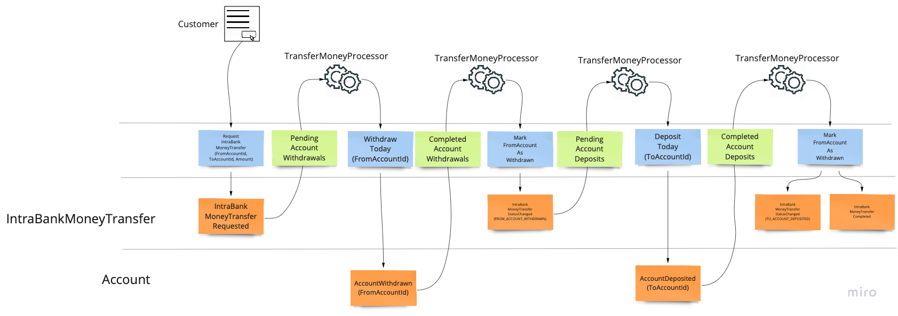

# Essentials components: PostgreSQL Event Store (CQRS) example

A Spring Boot application built on `spring-boot-starter-postgresql-event-store`, which auto-configures every
PostgreSQL-focused Essentials component plus the PostgreSQL `EventStore`. All `@Bean`s it contributes use
`@ConditionalOnMissingBean`, so any of them can be replaced by declaring your own.

This is the **event-sourced** example: every write goes through an `AggregateRoot` whose events are appended to
the `EventStore`, and every read is served by a projection built from those events. The two sibling examples
([`postgresql-inbox-outbox`](../postgresql-inbox-outbox/README.md), [`mongodb-inbox-outbox`](../mongodb-inbox-outbox/README.md))
model the same `shipping` domain **without** an event store, so the two styles can be compared side by side.

## What this example demonstrates

| Concept | Where to look |
|---|---|
| Event-sourced aggregate + repository | `banking/aggregates/`, `shipping/aggregates/`, `task/aggregates/` |
| Saga / process manager over two aggregates | `banking/automations/transfer_money/TransferMoneyProcessor` |
| The same process written *before* `EventProcessor` existed | `banking/automations/transfer_money/TransferMoneyProcessorOld` |
| Read-model projection (`ViewEventProcessor`) | `banking/views/account_balance/`, `shipping/views/order_status/` |
| Reacting to an event **inside the emitting transaction** | `task/automations/comment_on_task_created/` (`InTransactionEventProcessor`) |
| Anti-corruption boundary over Kafka | `shipping/external_systems/order_management/` |
| `RedeliveryPolicy` + `SendAndDontWaitErrorHandler` customization | `Application.java` |
| A per-processor `RedeliveryPolicy` | `ShippingEventKafkaPublisher.getInboxRedeliveryPolicy()` |
| Dead-letter behaviour of `sendAndDontWait` and of an `Inbox` | `src/test/.../EventProcessorIT` |
| `DocumentDbRepository` as projection storage | `config/DocumentDbConfiguration`, both `views/` slices |

## How the code is laid out

The module follows the Essentials **slice-design law**: code is grouped by the feature it serves, not by the
layer it belongs to. There is no `controllers/`, `services/`, `domain/` or `repositories/` anywhere. Each
bounded context looks like this, and each slice directory carries its own `slice.yaml` and `CLAUDE.md`:

```
<bc>/use_cases/<slice>/        command slices   - one command, one handler, one endpoint
    /views/<slice>/            view slices      - a read model, its projection and its queries
    /automations/<slice>/      process managers - react to events, no external API
    /external_systems/<sys>/   anti-corruption boundaries
    /events/  /types/  /aggregates/  /routing/
```

| Bounded context | Slices |
|---|---|
| `banking` | `open_account`, `request_intra_bank_money_transfer` (commands), `transfer_money` (automation), `account_balance` (view) |
| `shipping` | `register_shipping_order`, `ship_order` (commands), `order_management` (translation), `order_status` (view) |
| `task` | `create_task`, `add_comment` (commands), `comment_on_task_created` (automation) |

All three contexts use the **aggregate** write style (`AggregateRoot` + `StatefulAggregateRepository`), which
is a sanctioned lane — the slice law's decider style is the other. Start from a context's `CLAUDE.md`.

### Endpoints

| Method | Path | Dispatch | Slice |
|---|---|---|---|
| POST | `/banking/open-account` | `commandBus.send` (synchronous) | `banking.open_account` |
| POST | `/banking/transfer-money` | `commandBus.sendAndDontWait` (queued) | `banking.request_intra_bank_money_transfer` |
| GET | `/banking/accounts`, `/banking/accounts/{accountId}` | — | `banking.account_balance` |
| POST | `/shipping/register-order` | `commandBus.sendAndDontWait` (queued) | `shipping.register_shipping_order` |
| POST | `/shipping/ship-order` | `commandBus.sendAndDontWait` (queued) | `shipping.ship_order` |
| GET | `/shipping/orders`, `/shipping/orders/{orderId}`, `/shipping/orders?status=` | — | `shipping.order_status` |
| POST | `/tasks/create`, `/tasks/add-comment` | `commandBus.send` (synchronous) | `task.create_task`, `task.add_comment` |

The two `GET` families are served by **projections**, not by the write model, and are **eventually consistent** —
a read taken immediately after a command may still show the previous state. The `sendAndDontWait` endpoints
return as soon as the command is durably queued, so they are eventually consistent on the write side too.

---

## Flow 1 — Transfer Money (`banking`)

A Saga-like process: a user requests an intra-bank money transfer, i.e. a transfer between two accounts that
both belong to the same bank. Three aggregate instances are involved — the two `Account`s and the
`IntraBankMoneyTransfer` that tracks the attempt — and each is its own consistency boundary, changed by one
command at a time. The coordination between them therefore cannot live inside any of them; it lives in
`TransferMoneyProcessor`, an
[`EventProcessor`](../../../components/postgresql-event-store/README.md#eventprocessor) that subscribes to both
aggregate types and drives the transfer to completion one event at a time.



```
  POST /banking/transfer-money
        │  RequestIntraBankMoneyTransfer
        ▼
  ┌──────────────────────────┐   sendAndDontWait   ┌───────────────────────┐
  │ RequestIntraBank…API     │────────────────────▶│ DurableLocalCommandBus│
  └──────────────────────────┘                     │  (durable_queues)     │
                                                   └───────────┬───────────┘
                                                               │ (async, retried)
                                                               ▼
                                            ┌──────────────────────────────────┐
                                            │ RequestIntraBankMoneyTransfer    │
                                            │ Handler                          │
                                            │  · both accounts must exist      │
                                            │  · skip if transfer already there│
                                            └────────────────┬─────────────────┘
                                                             │ new IntraBankMoneyTransfer(...)
                                                             ▼
                                              ═══════════ EventStore ═══════════
                                              IntraBankMoneyTransferRequested
                                                    (status = REQUESTED)
                                                             │
   ┌─────────────────────────────────────────────────────────┘
   │  TransferMoneyProcessor  (EventProcessor — subscribes to
   │  AggregateTypes "Accounts" and "IntraBankMoneyTransfers";
   │  each event is delivered through the processor's own Inbox,
   │  so a failed step is retried rather than lost)
   │
   ├─▶ on IntraBankMoneyTransferRequested
   │        Account(from).withdrawToday(amount, transactionId, AllowOverdrawingBalance.NO)
   │        └─▶ AccountWithdrawn ──────────────────────────────┐
   │                                                           │
   ├─▶ on AccountWithdrawn ◀───────────────────────────────────┘
   │        transfer.markFromAccountAsWithdrawn()
   │        └─▶ IntraBankMoneyTransferStatusChanged(FROM_ACCOUNT_WITHDRAWN) ─┐
   │                                                                         │
   ├─▶ on IntraBankMoneyTransferStatusChanged ◀──────────────────────────────┘
   │        if status == FROM_ACCOUNT_WITHDRAWN:
   │            Account(to).depositToday(amount, transactionId)
   │            └─▶ AccountDeposited ──────────────────────────┐
   │                                                           │
   └─▶ on AccountDeposited ◀───────────────────────────────────┘
            transfer.markToAccountAsDeposited()
            ├─▶ IntraBankMoneyTransferStatusChanged(TO_ACCOUNT_DEPOSITED)
            └─▶ IntraBankMoneyTransferCompleted          ✔ transfer done
```

Three details worth noticing in the code:

- **The invariants live on the aggregates, not on the processor.** `Account.withdraw` throws
  `InsufficientFundsException` when the balance would go negative and overdrawing is disallowed;
  `IntraBankMoneyTransfer.markFromAccountAsWithdrawn` throws unless the transfer is in `REQUESTED`. The
  processor only decides *what happens next*, never *whether it is allowed*.
- **The last step re-enters the same handler.** `markToAccountAsDeposited` emits a second
  `IntraBankMoneyTransferStatusChanged`, this time with `TO_ACCOUNT_DEPOSITED`. `handle(IntraBankMoneyTransferStatusChanged)`
  runs again and does nothing, because it only acts on `FROM_ACCOUNT_WITHDRAWN`. That guard is what stops the
  process from looping.
- **Redelivery is what makes this safe.** Each `@MessageHandler` invocation is its own transaction. If the
  deposit fails, the withdrawal has already been committed and the deposit is simply retried by the
  processor's `Inbox` — the aggregate guards make the retry idempotent.

Balances are then projected by `AccountBalanceProjection` (a `ViewEventProcessor`) into a
`DocumentDbRepository`-backed table, which is what `GET /banking/accounts` reads.

### `TransferMoneyProcessorOld` — the before/after pair

Beside the processor sits `TransferMoneyProcessorOld`, deliberately unwired and kept as the "before" half of a
before/after pair. It implements exactly the same process the way it had to be written before `EventProcessor`
existed: hand-rolled `EventStoreSubscriptionManager` subscriptions, a manually configured `Outbox`, and an
explicit `UnitOfWork` in every handler. Read the two side by side.

### Test it

```bash
mvn verify -pl :postgresql-cqrs -Dit.test=TransferMoneyProcessorIT
```

---

## Flow 2 — Shipping (`shipping`)

The shipping context is the anti-corruption-boundary example: an external **OrderService** publishes order
events onto Kafka, this application reacts by shipping, and publishes its own event back onto Kafka. Neither
DTO on the wire uses this application's types.

```
   POST /shipping/register-order                        ┌─────────────────────────┐
         │ RegisterShippingOrder                        │  external OrderService  │
         ▼                                              └────────────┬────────────┘
  ┌────────────────────────┐                                         │ OrderAccepted
  │ RegisterShippingOrder  │                              Kafka topic│ {"id":"…"}   ← plain String id
  │ API                    │                            "order-events"
  └───────────┬────────────┘                                         ▼
              │ sendAndDontWait                    ┌────────────────────────────────┐
              ▼                                    │ OrderEventsKafkaListener       │
  ┌───────────────────────┐                        │  ⇦ THE TRANSLATION IN ⇨        │
  │ DurableLocalCommandBus│                        │  OrderId.of(event.id())        │
  │   (durable_queues)    │◀───────────────────────┤  sendAndDontWait(ShipOrder)    │
  └───────────┬───────────┘      ShipOrder         └────────────────────────────────┘
              │
    ┌─────────┴──────────┐
    ▼                    ▼
 ┌───────────────────┐  ┌──────────────────────────────────┐
 │ RegisterShipping  │  │ ShipOrderHandler                 │
 │ OrderHandler      │  │  order = shippingOrders.getOrder │
 │  skip if exists   │  │  order.markOrderAsShipped()      │
 │  new ShippingOrder│  │   └ no-op if already shipped     │
 └─────────┬─────────┘  └────────────────┬─────────────────┘
           │                             │
           ▼                             ▼
  ══════════════════ EventStore — AggregateType "ShippingOrders" ══════════════════
     ShippingOrderRegistered                    OrderShipped
           │                                          │
           ├──────────────┬───────────────────────────┤
           ▼              ▼                           ▼
 ┌────────────────────┐  ┌──────────────────────────────────────────────┐
 │ OrderStatusProject │  │ ShippingEventKafkaPublisher (EventProcessor) │
 │ ViewEventProcessor │  │  events arrive via the processor's own Inbox │
 │  → shipping_order_ │  │  ⇦ THE TRANSLATION OUT ⇨                     │
 │    status table    │  │  new ExternalOrderShipped(                   │
 └─────────┬──────────┘  │        e.orderId().toString(),  ← plain      │
           │             │        eventMessage.getOrder())   String     │
           ▼             └───────────────────┬──────────────────────────┘
   GET /shipping/orders                      │ kafkaTemplate.send(...)
   (eventually consistent)                   ▼
                                    Kafka topic "shipping-events"
```

Step by step:

1. `POST /shipping/register-order` puts `RegisterShippingOrder` on the `DurableLocalCommandBus` with
   `sendAndDontWait`, so it is persisted to `durable_queues` before the HTTP call returns.
2. `RegisterShippingOrderHandler` runs in the command bus's transaction. It skips the command if the order
   already exists — redelivery of a durable command must not be an error — and otherwise constructs
   `new ShippingOrder(orderId, destinationAddress)`, whose constructor applies `ShippingOrderRegistered`.
   `ShippingOrders.registerNewOrder` only *persists* the aggregate; it does not build it.
3. The external OrderService publishes `OrderAccepted` to the `order-events` topic. Its `id` is a plain
   `String` — the external contract does not know about `OrderId`.
4. `OrderEventsKafkaListener` is the **incoming half of the anti-corruption boundary**. It is the one and only
   place `String` becomes `OrderId`, and it forwards `ShipOrder` with `sendAndDontWait`. The command lands in
   `durable_queues`, so if the application dies between the Kafka poll and the handler running, the command is
   still there.
5. `ShipOrderHandler` loads the aggregate and calls `markOrderAsShipped()`. That method is the idempotency
   guard: messaging gives at-least-once delivery, so `ShipOrder` can arrive more than once, and a second call
   applies no event. `OrderShipped` is appended to the same stream.
6. `ShippingEventKafkaPublisher` extends `EventProcessor`, declaring `reactsToEventsRelatedToAggregateTypes()
   == [ShippingOrders.AGGREGATE_TYPE]`. The `EventProcessor` base class subscribes asynchronously to that
   aggregate type and routes each event through **its own durable `Inbox`** — that inbox, not an `Outbox`, is
   what makes the Kafka publish survive a crash. The example overrides `getInboxRedeliveryPolicy()` to show a
   per-processor policy that gives up immediately on `ConstraintViolationException` and
   `HttpClientErrorException.BadRequest`.
7. The handler is the **outgoing half of the boundary**: `OrderShipped` (which carries `OrderId`) becomes
   `ExternalOrderShipped(String orderId, long eventOrder)`, and that is what goes onto `shipping-events`. The
   `eventOrder` comes from the `OrderedMessage` the processor was handed: it is the event's **`EventOrder`** —
   its position within this `ShippingOrder`'s own stream, not the `GlobalEventOrder` across all streams — so a
   downstream consumer can order and deduplicate per order.

> **The Kafka DTOs must keep their plain `String` ids.** `OrderEvent.id()` and
> `ExternalOrderShippingEvent.orderId()` are deliberately not typed with `OrderId`. Typing them with the domain
> type means the boundary stops translating: an upstream id-format change reaches the domain directly, and the
> DTOs become sensitive to which Jackson flavour the application was built with. See
> `shipping/external_systems/order_management/CLAUDE.md`.

In parallel, `OrderStatusProjection` (a `ViewEventProcessor`) consumes the same two events into the
`shipping_order_status` document table, which `GET /shipping/orders` reads. It shows the two things every
projection needs: an **already-applied check** (`existing.getVersionValue() >= message.getOrder()`) so replays
are harmless, and an `onSubscriptionsReset` hook that wipes the view when the subscription is reset.

### Test it

```bash
mvn verify -pl :postgresql-cqrs -Dit.test=OrderShippingProcessorIT   # the full Kafka round-trip
mvn verify -pl :postgresql-cqrs -Dit.test=OrderStatusViewIT          # the projection
```

`OrderShippingProcessorIT` starts PostgreSQL and Kafka with Testcontainers, registers an order, publishes a
real `OrderAccepted` onto the topic, and asserts that exactly one `ExternalOrderShipped` comes back out on
`shipping-events` — and that the command queue drained to zero.

### Test it with `curl`

Start the runtime stack and the application from the `examples/essentials-spring-examples` folder (you may need
to wait 15-30 seconds for Tempo to be ready to ingest data):

```bash
docker compose up -d
mvn spring-boot:run -pl :postgresql-cqrs
```

The last command blocks the terminal, so open a second one for the requests below.

```bash
# 1. Register the shipping order
curl -L 'http://localhost:8080/shipping/register-order' \
  -X POST \
  -H 'Accept: application/json' \
  -H 'Content-Type: application/json' \
  -d '{
    "orderId": "order1",
    "destinationAddress": {
      "recipientName": "John Doe",
      "street": "Test Street 1",
      "zipCode": "1234",
      "city": "Test City"
    }
  }'

# 2. Ship it (in the real flow this command comes from the Kafka listener instead)
curl -L 'http://localhost:8080/shipping/ship-order' \
  -X POST \
  -H 'Accept: application/json' \
  -H 'Content-Type: application/json' \
  -d '{ "orderId": "order1" }'

# 3. Read the projection back
curl 'http://localhost:8080/shipping/orders'
curl 'http://localhost:8080/shipping/orders/order1'
curl 'http://localhost:8080/shipping/orders?status=SHIPPED'
```

In the Spring Boot terminal you should see log entries similar to:
`... [postgresql-cqrs] [....] [e7754a2059013cfdff422bfeda5d3e09-4acc5a9396d96dfc]...`

The second value (`e7754a2059013cfdff422bfeda5d3e09`) is the `traceId`. Open Grafana at
`http://localhost:3000`, go to the `Logs, Traces, Metrics` dashboard, and paste it into the `Trace ID` box.

Stop with `Ctrl-C`, then `docker compose down -v`.

---

## Flow 3 — Comment on task created (`task`)

The smallest context, and it exists for exactly one reason: to show an `InTransactionEventProcessor` reacting to
an event and issuing a follow-up command **inside the same unit of work that appended it**. Everywhere else in
this module, reacting to an event happens in a later transaction.

```
  POST /tasks/create   { "taskId": "…", "comment": "…" }
        │
        ▼  commandBus.send  (synchronous — the caller learns the task was accepted)
  ┌──────────────────────────────────────────────────────────────────────────────┐
  │                        one UnitOfWork / one transaction                      │
  │                                                                              │
  │  CreateTaskHandler                                                           │
  │    tasks.createNewTask(new Task(cmd.taskId(), cmd.comment()))                │
  │        └─▶ apply(TaskCreated) ──▶ EventStore  (AggregateType "Task")         │
  │                    │                                                         │
  │                    ▼                                                         │
  │  CommentOnTaskCreatedProcessor  (InTransactionEventProcessor)                │
  │    if (event.comment() != null)                                              │
  │        commandBus.send(new AddComment(taskId, comment, createdAt))           │
  │                    │                                                         │
  │                    ▼                                                         │
  │  AddCommentHandler                                                           │
  │    task.addComment(content, createdAt)                                       │
  │        └─▶ apply(CommentAdded) ──▶ EventStore                                │
  │                                                                              │
  └──────────────────────────────────────── commit ──────────────────────────────┘
              TaskCreated and CommentAdded become visible together
```

`CreateTask` may carry a comment. Rather than have the aggregate quietly emit two events, the automation
observes `TaskCreated` and issues an explicit `AddComment`, so the comment lands as its own event with its own
command behind it — while still committing atomically with the creation. `TaskProcessorIT` asserts exactly
that, by collecting `PersistedEvents` at `CommitStage.BeforeCommit` and checking that both events were
persisted by the single `commandBus.send`.

Read the slices in the order `create_task` → `comment_on_task_created` → `add_comment`; the flow only makes
sense as a chain.

### Test it

```bash
mvn verify -pl :postgresql-cqrs -Dit.test=TaskProcessorIT
```

---

## Build and run

```bash
mvn verify -pl :postgresql-cqrs                    # unit + integration tests (needs Docker)
mvn -Pjackson2 verify -pl :postgresql-cqrs -am     # the other Jackson flavour; -am is required
docker compose up -d && mvn spring-boot:run -pl :postgresql-cqrs
```

All commands are run from the `examples/essentials-spring-examples` folder. The `-am` is not optional on the
non-default Jackson flavour — see [the aggregator README](../README.md#jackson-flavour).

### Integration tests

| Test | What it covers |
|---|---|
| `banking/use_cases/open_account/OpenAccountIT` | the `open_account` command slice |
| `banking/TransferMoneyProcessorIT` | the full transfer saga |
| `banking/AccountsIT` | the `Account` aggregate and its repository |
| `banking/views/account_balance/AccountBalanceViewIT` | the balance projection |
| `shipping/OrderShippingProcessorIT` | register → Kafka `OrderAccepted` → ship → Kafka `ExternalOrderShipped` |
| `shipping/views/order_status/OrderStatusViewIT` | the order-status projection |
| `task/TaskProcessorIT` | `InTransactionEventProcessor` — both events in one commit |
| `EventProcessorIT` | `EventProcessor` mechanics in isolation: command handling, and dead-lettering of a failing command sent both via `sendAndDontWait` and via an `Inbox` |

---

## Application Setup

Everything this application needs is auto-configured by
[`spring-boot-starter-postgresql-event-store`](../../../components/spring-boot-starter-postgresql-event-store/README.md),
which builds on [`spring-boot-starter-postgresql`](../../../components/spring-boot-starter-postgresql/README.md).

**Those two READMEs are the reference for the complete bean list and every `essentials.*` property, including
the security notices for the configurable table names.** They are kept in step with the code; the sections
below only record what *this example* configures on top of the defaults, and are not a substitute.

In short, the starters provide: `Jdbi` + `SpringTransactionAwareEventStoreUnitOfWorkFactory`,
`PostgresqlEventStore` with `SeparateTablePerAggregateTypePersistenceStrategy`, `EventStoreEventBus`,
`EventStoreSubscriptionManager`, `EventProcessorDependencies`, `PostgresqlDurableQueues`, `Inboxes`/`Outboxes`,
`DurableLocalCommandBus`, `PostgresqlFencedLockManager`, `MultiTableChangeListener`,
`ReactiveHandlersBeanPostProcessor` (which is what auto-registers every `@CmdHandler` and `@Handler` bean in
this module), `JacksonJSONEventSerializer`, the Micrometer interceptors, and the admin API beans.

> ⚠️ **Security.** `essentials.durable-queues.shared-queue-table-name` and
> `essentials.fenced-lock-manager.fenced-locks-table-name` are concatenated into SQL. Derive them from a
> trusted source only. The starter READMEs carry the full notice.

### What this example configures — `src/main/resources/application.properties`

```properties
essentials.immutable-jackson-module-enabled=true

# Reactive buses
essentials.reactive.event-bus-backpressure-buffer-size=1024
essentials.reactive.overflow-max-retries=20
essentials.reactive.queued-task-cap-factor=1.5

# EventStore
essentials.event-store.identifier-column-type=text
essentials.event-store.json-column-type=jsonb
essentials.event-store.use-event-stream-gap-handler=true
essentials.event-store.verbose-tracing=false
essentials.event-store.subscription-manager.event-store-polling-batch-size=5
essentials.event-store.subscription-manager.snapshot-resume-points-every=2s
essentials.event-store.subscription-manager.event-store-polling-interval=200

# DurableQueues (backs the command bus, every EventProcessor Inbox, and every Outbox)
essentials.durable-queues.shared-queue-table-name=durable_queues
essentials.durable-queues.transactional-mode=singleoperationtransaction
essentials.durable-queues.use-centralized-message-fetcher=true
essentials.durable-queues.centralized-message-fetcher-polling-interval=20ms
essentials.durable-queues.polling-delay-interval-increment-factor=0.5
essentials.durable-queues.max-polling-interval=2s
essentials.durable-queues.verbose-tracing=true

essentials.fenced-lock-manager.fenced-locks-table-name=fenced_locks
essentials.fenced-lock-manager.lock-confirmation-interval=5s
essentials.fenced-lock-manager.lock-time-out=12s
essentials.fenced-lock-manager.release-acquired-locks-in-case-of-i-o-exceptions-during-lock-confirmation=false

essentials.multi-table-change-listener.filter-duplicate-notifications=true
essentials.multi-table-change-listener.polling-interval=100ms

# Metrics — operations slower than a threshold are logged at that level; see the starter README
essentials.event-store.metrics.enabled=true
essentials.event-store.subscription-manager.metrics.enabled=true
essentials.metrics.durable-queues.enabled=true
essentials.metrics.command-bus.enabled=true
essentials.metrics.message-handler.enabled=true
# … each with .thresholds.{debug,info,warn,error} = 25ms / 200ms / 500ms / 5000ms
```

Notes on the values this example picks:

- **`transactional-mode=singleoperationtransaction`** is the recommended mode and the starter default.
  `fullytransactional` makes queue operations join the caller's transaction, which breaks retry counting and
  dead-lettering, because a failure marks the whole transaction for rollback.
- **CDC (logical replication) is left at its default**, i.e. enabled with `CdcMode.AUTO`. This example does not
  showcase CDC — [`essentials-performance-lab`](../../essentials-performance-lab/README.md) does — but leaving
  the default in place keeps it honest about what an application gets out of the box: `AUTO` falls back to
  polling when the database is not configured for logical replication, which is the case for the plain
  `postgres:latest` image the integration tests run against.
- **The fenced-lock and multi-table-change-listener values differ from the starter defaults** (`15s`/`4s` and
  `50ms` respectively). They are set explicitly here so the file doubles as a worked example of the properties;
  neither choice is a recommendation.

### What this example overrides in code

`Application.java` declares the two `DurableLocalCommandBus` extension points, both of which apply only to
**fire-and-forget** commands sent with `CommandBus.sendAndDontWait`:

```java
/**
 * Custom {@link RedeliveryPolicy} for the auto-configured {@link DurableLocalCommandBus}.
 * Overrides DurableLocalCommandBus.DEFAULT_REDELIVERY_POLICY simply by being a bean of this type.
 */
@Bean
RedeliveryPolicy durableLocalCommandBusRedeliveryPolicy() {
    return RedeliveryPolicy.exponentialBackoff()
                           .setInitialRedeliveryDelay(Duration.ofMillis(200))
                           .setFollowupRedeliveryDelay(Duration.ofMillis(200))
                           .setFollowupRedeliveryDelayMultiplier(1.1d)
                           .setMaximumFollowupRedeliveryDelayThreshold(Duration.ofSeconds(3))
                           .setMaximumNumberOfRedeliveries(20)
                           // Some failures will never succeed on retry - fail them straight to a dead-letter
                           .setDeliveryErrorHandler(
                                   MessageDeliveryErrorHandler.stopRedeliveryOn(
                                           ConstraintViolationException.class,
                                           HttpClientErrorException.BadRequest.class))
                           .build();
}

/**
 * Custom {@link SendAndDontWaitErrorHandler} for the auto-configured {@link DurableLocalCommandBus}.
 * If this handler does not rethrow, the command is neither retried nor dead-lettered.
 * The default is SendAndDontWaitErrorHandler.RethrowingSendAndDontWaitErrorHandler.
 */
@Bean
SendAndDontWaitErrorHandler sendAndDontWaitErrorHandler() {
    return (exception, commandMessage, commandHandler) -> {
        // Example of never retrying HttpClientErrorException.Unauthorized -
        // the failure is logged, but the command is never retried nor marked as a dead-letter/poison message
        if (exception instanceof HttpClientErrorException.Unauthorized) {
            log.error("Unauthorized exception", exception);
        } else {
            Exceptions.sneakyThrow(exception);
        }
    };
}
```

`EventProcessorIT` exercises both paths end to end: a command that always throws is dead-lettered when sent with
`sendAndDontWait`, and likewise when delivered through an `EventProcessor`'s `Inbox`.

Two more configuration classes carry example-specific wiring:

| Class | Role |
|---|---|
| `config/DocumentDbConfiguration` | the `DocumentDbRepositoryFactory` both projections build their repositories from |
| `config/KafkaConfiguration` | Kafka producer/consumer factories and the trusted-packages prefix for the `shipping` boundary |
| `banking/views/account_balance/AccountBalanceRepositoryConfiguration`, `shipping/views/order_status/OrderStatusRepositoryConfiguration` | one `DocumentDbRepository` bean per view slice, including its indexes |
