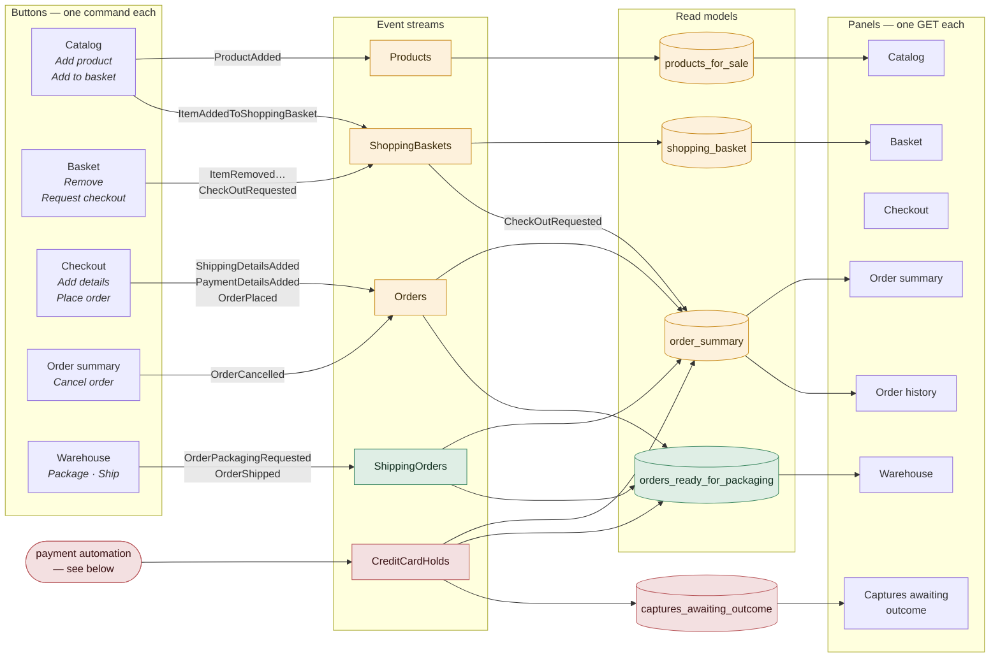
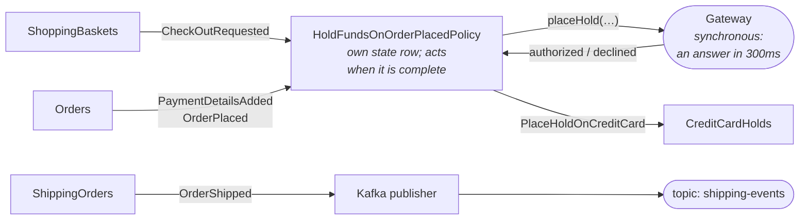

# What feeds each panel on the shop page

`src/main/resources/static/shop/index.html` is seven panels. Every one of them is a *view slice* reading its own
read model over one HTTP GET, and every button is one *command*. Nothing on the page reads an aggregate, and no
panel queries another panel's data.

This document is the map between the two: which command a button sends, which event that records, and which
projection turns that event into the rows a panel renders. It is the same picture as the event model in the
module's `CLAUDE.md`, seen from the browser rather than from the streams.

## The page, end to end

Read it strictly left to right. A button writes an event to one stream; a projection turns streams into a read
model; a panel renders one read model. There is no arrow back the other way, because there is no path back the
other way: nothing on the write side knows a screen exists.

The Checkout panel is the odd one out: it only writes. It shows the order id the browser minted and nothing
else, which is why no read model points at it.

## The two subscribers that are not panels

Same events, same mechanism — these two just act on them instead of displaying them. The payment automation is
the only cycle in the whole system, and it is a deliberate one: it subscribes to events, and what it decides
becomes an event.

## And the one that answers later

Capture is the same pattern with the answer detached from the question, which is what every real card platform
does. Read the numbered path: the request is **recorded before the call**, so an answer that never comes is
still a charge we can find and ask about.

```mermaid
flowchart LR
    S5["ShippingOrders"] -- "① OrderPackagingRequested" --> C
    S4a["CreditCardHolds"] -- "① CreditCardHoldPlaced" --> C
    C["CaptureFundsWhenPackagedPolicy<br/><i>own state row</i>"]
    C -- "② RequestFundsCapture" --> S4b["CreditCardHolds<br/><i>FundsCaptureRequested</i>"]
    S4b -- "③ then, and only then" --> C
    C -- "④ requestCapture(key, …)" --> G2(["Gateway<br/><i>202 Accepted,<br/>no outcome</i>"])

    G2 -. "⑤ webhook, at least once,<br/>possibly never" .-> W["POST /api/payment/<br/>webhooks/card-gateway"]
    W -- "⑥ store + 202" --> I[("Inbox")]
    I -- "⑦ RecordCaptureOutcome" --> S4c["CreditCardHolds<br/><i>FundsCaptured | Failed</i>"]

    S4b --> V5[("captures_awaiting_outcome")]
    V5 -- "⑧ nothing came back" --> R["CaptureReconciler<br/><i>on a clock, not an event</i>"]
    R -- "outcomeFor(key)" --> G2
    R -- "RecordCaptureOutcome" --> S4c
    S4c --> V5

    classDef pay fill:#f3e0e1,stroke:#b9585c,color:#3a1214
    class S4a,S4b,S4c,C,V5,R pay
```

Why each arrow is where it is - the timing argument, the idempotency key, and what the reconciler does with each
of the gateway's three possible answers - is in [payment-async-capture.md](payment-async-capture.md).

## Panel by panel

| Panel | Reads | Fed by | Buttons send |
|---|---|---|---|
| Catalog | `GET /api/products-for-sale` | `ProductAdded`, `ProductPriceChanged` | `AddProduct`, `AddItemToShoppingBasket` |
| Basket | `GET /api/shopping-baskets/{id}` | `ItemAddedToShoppingBasket`, `ItemRemovedFromShoppingBasket` | `RemoveItemFromShoppingBasket`, `RequestCheckOut` |
| Checkout | — (writes only; shows the minted order id) | — | `AddShippingDetailsToOrder`, `AddPaymentDetailsToOrder`, `PlaceOrder` |
| Order summary | `GET /api/orders/{id}/summary` | **four streams**: `ShoppingBaskets`, `Orders`, `CreditCardHolds`, `ShippingOrders` | `CancelOrder` |
| Order history | `GET /api/orders?page&size` | the same read model as the summary, queried without an id, one page at a time | — (picking a row only changes which order the summary shows) |
| Warehouse | `GET /api/shipping/orders-ready-for-packaging` | **three streams**: `Orders`, `CreditCardHolds`, `ShippingOrders` | `PackageOrder`, `ShipOrder` |
| Captures awaiting outcome | `GET /api/payment/captures-awaiting-outcome` | `FundsCaptureRequested` in, `FundsCaptured`/`FundsCaptureFailed` out | — (the reconciler drains it, not a button) |

## Five things the diagrams are there to make obvious

**No panel talks to another context's write side.** The warehouse panel shows an address that `sales` collected
and a block that `payment` decided, and `shipping` obtained both by subscribing to events. It holds no reference
to a `sales` or `payment` class beyond their exported `events/` packages, and calls neither.

**The guards live in the read models.** A decider sees one stream, so `PackageOrderDecider` cannot know the card
was refused and `CancelOrderDecider` cannot know it was refused either. Both facts reach the screen through a
projection instead, and the screen is what withholds the button. A read model is allowed to be a moment stale;
a decider is not, which is exactly why the check goes where staleness is survivable.

**One read model answers both "this order" and "all orders".** The history panel is not a second projection
and not a second query shape - it is the same rows without a `where` on the id, and with a `limit`. A read model
is built for the question the screen asks, and these two screens ask the same question at different scope. Paging
happens in SQL: the endpoint returns one page plus the total, so the panel can say "11-18 of 18" without the
application ever loading eighteen rows to show eight.

**An automation with side effects is not a projection.** Both subscribe to the same streams with the same
mechanism, and they differ in what replaying them costs. Rebuilding `order_summary` rewrites rows; rebuilding
`CaptureFundsWhenPackagedPolicy` charges cards - which it did, to nine already-shipped orders, the first time it
ran against a database with history in it. Hence `isStartSubscriptionFromLatestEvent()` on the policies and not
on the projections.

**The page polls because the writes do not wait.** A command returns once its own event is appended. The
projections and the payment automation each run on their own subscription and catch up afterwards, so every
button refreshes its panels a few times over the next couple of seconds rather than assuming the next render is
complete. That gap is the demo's subject, not a defect to hide.
